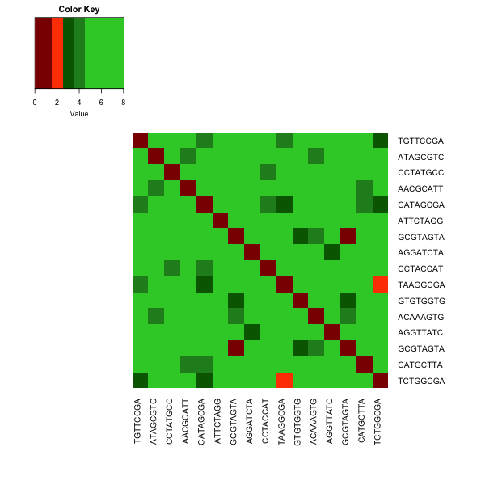

# BarcodeSimilarity

A short script to test the similarity of barcodes for Illumina sequencing. It is helpful to ensure no barcode collisions will occur.

You need to load a text file where each row is a barcode sequence of equal length (see example: bcs.txt).

The script will generate a figure where the color indicates the number of differences between molecular barcodes (see example: hamming.png).

