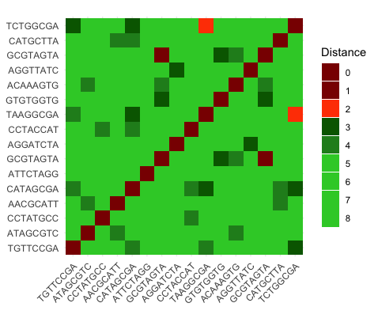

# BarcodeSimilarity

BarcodeSimilarity.R is a short script to test the similarity of next-generation sequencing barcodes. It is helpful to ensure no barcode collisions will occur.

You need to load a data frame where each row is a barcode sequence of equal length. The script will generate a heatmap where the color indicates the number of differences between molecular barcodes.

As an example, we test the similarity between 8 bp Illumina library barcodes using the script BarcodeSimilarity.R and Illumina_libraries/bcs.txt as input. The output is Illumina_libraries/hamming.png:

McAllister_SunCatcher/McAllister_barcodes.R is an older version of the script to test the similarity between barcodes of the [SunCatcher lineage tracing system](https://doi.org/10.1038/s41467-022-31536-5) using McAllister_SunCatcher/BC_sequences.xlsx as input. The output is McAllister_SunCatcher/hamming.pdf.

